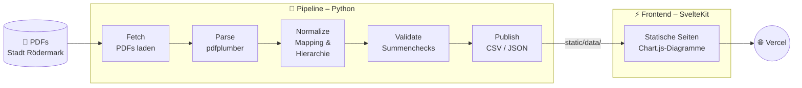

# Haushalt Rödermark

**Kommunale Haushaltsdaten – aus PDFs extrahiert, strukturiert und interaktiv visualisiert.**

[](https://roedermark-haushalt.christian-engel.dev)
[](LICENSE)
[](https://python.org)
[](https://svelte.dev)

<p align="center">
  
</p>

---

## Warum dieses Projekt?

Kommunale Haushaltspläne sind öffentlich – aber nicht zugänglich. Die PDFs der Stadt Rödermark umfassen hunderte Seiten mit verschachtelten Tabellen, Teilhaushalten und Konten. Als ich angefangen habe, mich mit dem Thema zu beschäftigen, habe ich schnell gemerkt: Die Daten sind da, aber man muss Stunden investieren, um sie zu verstehen.

Deshalb habe ich eine Pipeline gebaut, die diese PDFs automatisiert ausliest und die Zahlen in eine interaktive Web-Oberfläche überführt – damit man Einnahmen, Ausgaben, Investitionen und Schulden auf einen Blick vergleichen kann, statt hunderte PDF-Seiten zu durchsuchen.

Das Projekt ist Open Source, damit andere es für **ihre eigene Kommune** anpassen können.

---

## Features

- 📊 **Ergebnis- & Finanzhaushalt** – Erträge, Aufwendungen, Ein- und Auszahlungen im Jahresvergleich
- 🏗️ **Investitionen** – Investitionsausgaben nach Themen, mit Einzelprojekten und Kommentaren
- 💰 **Steuereinnahmen** – Zusammensetzung, Hebesätze im Vergleich mit dem Kreis Offenbach
- 📉 **Schulden & Zinsen** – Verschuldung, Tilgung und Zinsbelastung seit 1986
- 🏢 **Teilhaushalte** – Alle Teilhaushalte mit Ergebnis- und Finanzhaushalt
- 🗂️ **Kategorien** – Ausgaben nach lebensnahen Bereichen (Kinderbetreuung, Schulen, Feuerwehr …)
- 🔍 **Daten-Explorer** – Alle Positionen durchsuchbar und filterbar
- 📄 **Quellenrückverfolgbarkeit** – Jede Zahl verweist auf PDF, Seite und Tabelle

---

## Architektur



---

## Voraussetzungen

| Tool | Version | Zweck |
|------|---------|-------|
| Python | ≥ 3.11 | Pipeline |
| [uv](https://docs.astral.sh/uv/) | aktuell | Python-Paketmanager |
| Node.js | ≥ 18 | Frontend |
| Make | – | Task-Runner (optional) |

---

## Quickstart

### 1. Repository klonen

```bash
git clone https://github.com/Paratron/roedermark-haushalt.git
cd roedermark-haushalt
```

### 2. Pipeline einrichten & ausführen

```bash
make setup          # venv erstellen, Dependencies installieren
make pipeline       # Komplette Pipeline: fetch → parse → normalize → publish
```

Oder einzelne Schritte:

```bash
make fetch          # PDFs herunterladen
make parse          # Tabellen aus PDFs extrahieren
make normalize      # Daten normalisieren
make validate       # Plausibilitätsprüfungen
make publish        # JSON/CSV für das Frontend erzeugen
```

### 3. Frontend starten

```bash
cd frontend
npm install
npm run dev         # http://localhost:5173
```

---

## Projektstruktur

```
├── pipeline/               # Python-Pipeline
│   ├── fetch/              #   PDFs herunterladen
│   ├── parse/              #   Tabellen & Text extrahieren
│   ├── normalize/          #   Daten normalisieren & vereinheitlichen
│   ├── validate/           #   Summen- & Plausibilitätschecks
│   └── publish/            #   Export als CSV/JSON für das Frontend
│
├── frontend/               # SvelteKit-Webapp
│   ├── src/
│   │   ├── lib/            #   Komponenten, Typen, Hilfsfunktionen
│   │   └── routes/         #   Seiten (Ergebnis, Finanz, Steuern …)
│   └── static/data/        #   Publizierte Daten (vom Pipeline-Output)
│
├── data/
│   ├── raw/                #   Heruntergeladene PDFs (nicht im Repo)
│   ├── extracted/          #   Extrahierte Tabellen/Texte (nicht im Repo)
│   └── published/          #   Publizierte Daten (nicht im Repo)
│
├── docs/                   # Dokumentation
│   ├── methodology.md      #   Methodik der Datenerhebung
│   ├── data-dictionary.md  #   Datenwörterbuch
│   └── limitations.md      #   Bekannte Einschränkungen
│
├── sources.yaml            # Alle Quell-Dokumente (URLs, Typ, Jahre)
├── categories.yaml         # Kategorie-Definitionen für die UI
├── mappings.yaml           # Spalten-/Zeilen-Mappings für die Normalisierung
├── Makefile                # Task-Runner
└── pyproject.toml          # Python-Projektdefinition
```

---

## Datenquellen

Alle Daten stammen aus **öffentlich zugänglichen PDF-Dokumenten** der Stadt Rödermark:

- Haushaltspläne (Entwürfe und Beschlüsse), 2017–2026
- Jahresabschlüsse
- Haushaltssatzungen und Bekanntmachungen

Die vollständige Liste aller Dokumente findet sich in [sources.yaml](sources.yaml).

---

## Für andere Kommunen anpassen

Das Projekt ist auf Rödermark zugeschnitten, aber die grundlegende Architektur lässt sich auf andere hessische (oder allgemein NKF-/Doppik-)Kommunen übertragen. Was angepasst werden muss:

| Bereich | Aufwand | Was zu tun ist |
|---------|---------|----------------|
| `sources.yaml` | gering | URLs der PDFs deiner Kommune eintragen |
| `categories.yaml` | gering | Kategorien ggf. anpassen |
| Parse-Logik | **hoch** | Jede Kommune hat andere PDF-Layouts – Tabellenerkennung muss angepasst/neu geschrieben werden |
| `mappings.yaml` | mittel | Spaltenköpfe, Hierarchieebenen, Kontenrahmen anpassen |
| Frontend | gering–mittel | Texte, Farben, Branding ersetzen; Seitenstruktur passt für NKF-Kommunen |

> **Tipp:** Die größte Hürde ist die Tabellenerkennung in den PDFs. Wenn deine Kommune das gleiche PDF-Layout nutzt (ähnliches DV-Verfahren), könnte der Parser mit wenig Anpassung funktionieren. Andernfalls ist das der zeitintensivste Teil.

---

## Bekannte Einschränkungen

- Keine Vollständigkeitsgarantie – nicht alle Positionen aller Jahre sind erfasst
- Automatische Tabellenextraktion kann Fehler enthalten (werden per Summenchecks validiert)
- Keine politische Bewertung – die Darstellung ist rein deskriptiv
- Details siehe [docs/limitations.md](docs/limitations.md)

---

## Mitmachen

Beiträge sind willkommen! Egal ob:

- 🐛 **Bug melden** – Falsche Zahlen gefunden? [Issue öffnen](https://github.com/Paratron/roedermark-haushalt/issues)
- 📊 **Daten ergänzen** – Fehlende Jahrgänge oder Positionen
- 🎨 **Frontend verbessern** – Design, Barrierefreiheit, neue Visualisierungen
- 🏘️ **Eigene Kommune** – Du hast es für deine Kommune angepasst? Lass es mich wissen!

---

## Lizenz

[MIT](LICENSE) – frei nutzbar, auch kommerziell.

---

## Disclaimer

Dies ist ein **privates Open-Source-Projekt** und kein offizielles Angebot der Stadt Rödermark. Alle Daten wurden automatisiert aus öffentlichen Dokumenten extrahiert. Für die Richtigkeit wird keine Gewähr übernommen. Im Zweifel gelten die [Original-PDFs der Stadt](https://roedermark.de/rathaus-politik/haushalt-und-berichte.html).

